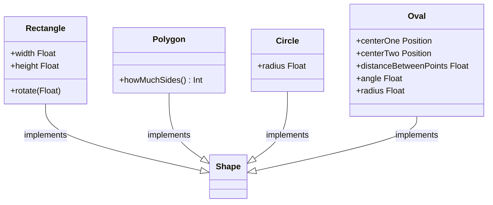

# K2D (Kotlin to Documentation)

Generate diagram sequences (mermaid format), markdown tables and more based on your code directly.

Current version: <!--$ GRADLE_PROPERTIES version -->0.4.6<!-- END $-->

## [DEMO for Dokka](https://www.glureau.com/K2D/html/)

Setup to draw a UML-like graph is flexible and supports regexes and include/exclude rules.

```kotlin
@file:K2DMermaidGraph(
    name = "Shapes23", // file name generated in build/generated/ksp/**/resources/
    symbolSelector = K2DSymbolSelectorAnnotation(
        includesCurrentPackage = true, // take all symbols in the current package
        excludesClasses = [Position::class], // Exclude explicitely Position class
        excludesFqnRegex = "sample\\.[a-z]+.*", // another rule based on regex for example
    )
)
package sample
```

Another more complex example:

```kotlin
@file:K2DMermaidGraph(
    name = "Shape_inheritance",
    symbolSelector = K2DSymbolSelectorAnnotation(
        includesCurrentPackage = false,
        includesClassesInheritingFrom = [Shape::class],
        excludesClasses = [Direction::class],
    ),
    configuration = K2DMermaidRendererConfiguration(
        showClassType = false,
        basicIsDown = true,
    )
)
```

can generate



With a simple setup, you can generate a classes diagram for an entire package, and produce similar diagrams in your
documentation.


This plugin generates markdown file so you can use it with Dokka (as screenshots above) or any other documentation tool
supporting mermaid diagrams.

You can also generate a more basic tables based on comments and property/function signatures:

```kotlin
@file:K2DMarkdownClassTable(
    name = "Circle_no_functions",
    symbolSelector = K2DSymbolSelectorAnnotation(
        includesCurrentPackage = false,
        includesClasses = [Circle::class],
    ),
    configuration = K2DMarkdownClassTableConfiguration(
        showClassFunctions = false,
    )
)
```

will generate

> ### Circle
>
>##### Properties
>
>| Name           | Type       | Comments |
>|----------------|------------|----------|
>| originPosition | [Position] |          |
>| radius         | [Float]    |          |

## KSP version

| K2D       | KSP           | Java |
|-----------|---------------|------|
| 0.4.1     | 1.8.0-1.0.9   | 1.8  |
| 0.4.2     | 1.8.10-1.0.9  | 11   |
| 0.4.3     | 1.8.10-1.0.9  | 11   |
| 0.4.4     | 1.8.10-1.0.9  | 11   |
| ~~0.4.5~~ | 2.0.21-1.0.27 | 17   |
| 0.4.6     | 2.0.21-1.0.27 | 17   |

# Installation

Add the K2D plugin to your `build.gradle.kts`:

```kotlin
plugins {
    id("com.glureau.k2d") version "0.1.2"
}
```

Then, in the module where you want to generate diagrams or tables, add the KSP dependency:

```kotlin
dependencies {
    ksp("com.glureau.k2d:k2d-processor:0.1.2")
}
```

And add annotations in the files where you want to generate diagrams or tables.
