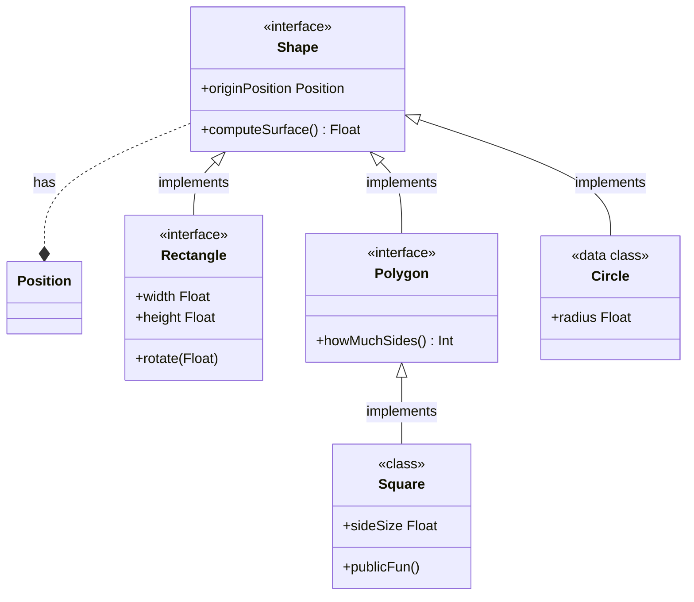

# Hello !

<!--- TOC -->

  * [Mermaid example](#mermaid-example)
* [Function & Properties](#function-&-properties)
  * [Shape](#shape)
    * [Properties](#properties)
    * [Functions](#functions)
  * [Square](#square)
    * [Properties](#properties)
    * [Functions](#functions)

<!--- END -->

Those values below are updated automatically...

Introduction to the library **_v.<!--$ GRADLE_PROPERTIES version -->0.1.1<!-- END $-->_** (from gradle properties)

Build on Kotlin **_<!--$ GRADLE_PROPERTIES kotlinVersion -->1.7.10<!-- END $-->_** (also from gradle properties)

Documentation update from computer with system env **_LOGNAME=<!--$ SYSTEM_ENV LOGNAME -->glureau<!-- END $-->_**

Last documentation update: **_<!--$ DATETIME yyyy.MM.dd G 'at' HH:mm:ss z -->2022.10.12 AD at 00:44:15 CEST<!-- END $-->_**

### Mermaid example

<!--$ INSERT build/generated/ksp/metadata/commonMain/resources/Shapes23.md -->

<!-- END $-->

## Function & Properties

Fully generated documentation above + additional high-level documentation

### Shape

My custom documentation about shape is here, and here is the dynamic part:

<!--$ INSERT build/generated/ksp/metadata/commonMain/resources/table_Shape.md -->
#### Properties

| Name           | Type     | Comments |
|----------------|----------|----------|
| originPosition | Position |          |

#### Functions

| Name           | Return Type | Comments |
|----------------|-------------|----------|
| computeSurface | Float       |          |

<!-- END $-->

And I can complete with hardcoded part at any time

### Square

How is defined a Square??

<!--$ INSERT build/generated/ksp/metadata/commonMain/resources/table_Square.md -->
#### Properties

| Name           | Type     | Comments |
|----------------|----------|----------|
| originPosition | Position |          |
| sideSize       | Float    |          |

#### Functions

| Name           | Return Type | Comments |
|----------------|-------------|----------|
| computeSurface | Float       |          |
| howMuchSides   | Int         |          |
| internalFun    | Unit        |          |
| privateFun     | Unit        |          |
| protectedFun   | Unit        |          |
| publicFun      | Unit        |          |

<!-- END $-->
