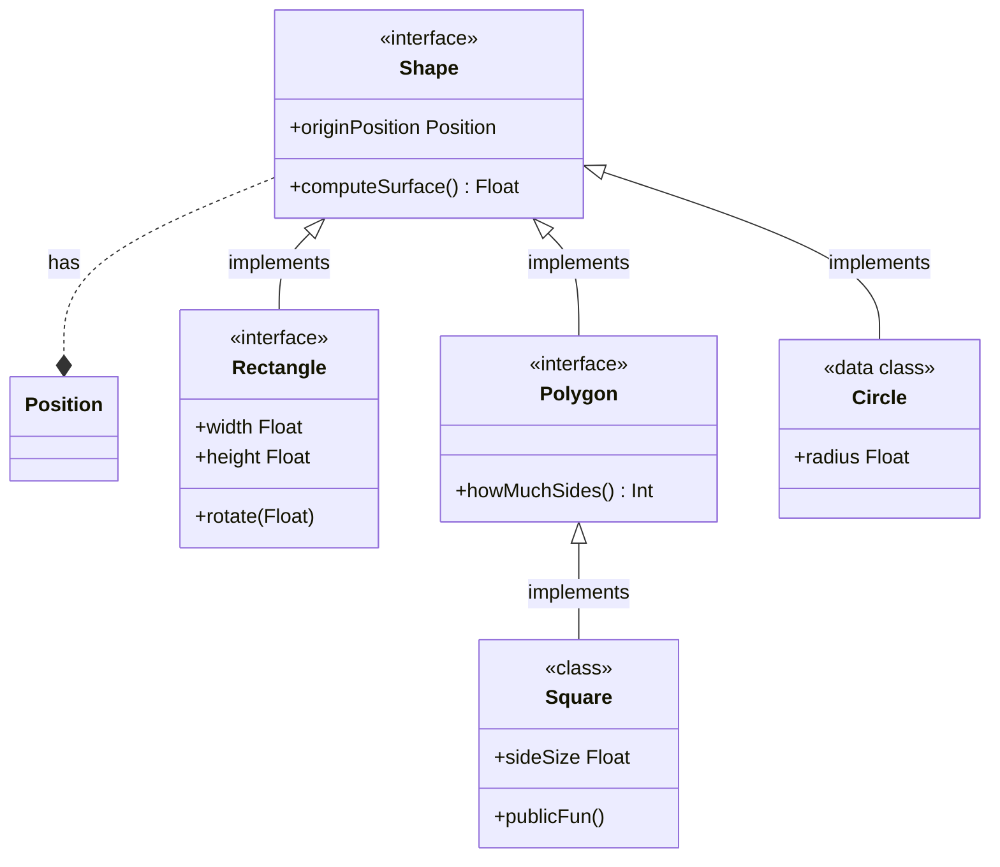

<!--- TOC -->

  * [Let's see the schema!](#let's-see-the-schema)
* [Part 2](#part-2)
  * [Shape](#shape)
    * [Properties](#properties)
    * [Functions](#functions)
  * [Square](#square)
    * [Properties](#properties)
    * [Functions](#functions)
  * [Chapter 4](#chapter-4)

<!--- END -->
# Hello !

Introduction to the library

### Let's see the schema!

<!--$ INSERT build/generated/ksp/metadata/commonMain/resources/Shapes23.md -->

<!-- END $-->

## Part 2

### Shape

My custom documentation about shape is here, and here is the dynamic part:

<!--$ INSERT build/generated/ksp/metadata/commonMain/resources/table_Shape.md -->
#### Properties

| Name           | Type     | Comments |
|----------------|----------|----------|
| originPosition | Position |          |

#### Functions

| Name           | Return Type | Comments |
|----------------|-------------|----------|
| computeSurface | Float       |          |

<!-- END $-->

And I can complete with hardcoded part at any time

### Square

How is defined a Square??

<!--$ INSERT build/generated/ksp/metadata/commonMain/resources/table_Square.md -->
#### Properties

| Name           | Type     | Comments |
|----------------|----------|----------|
| originPosition | Position |          |
| sideSize       | Float    |          |

#### Functions

| Name           | Return Type | Comments |
|----------------|-------------|----------|
| computeSurface | Float       |          |
| howMuchSides   | Int         |          |
| internalFun    | Unit        |          |
| privateFun     | Unit        |          |
| protectedFun   | Unit        |          |
| publicFun      | Unit        |          |

<!-- END $-->

### Chapter 4

aer
