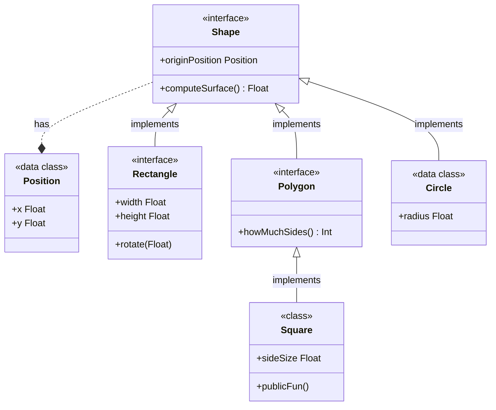

<!--- TOC -->

* [Part 1](#part-1)
  * [Chapter 1](#chapter-1)
  * [Chapter 2](#chapter-2)
  * [Chapter 3](#chapter-3)
* [Details of Shape](#details-of-shape)
    * [Properties](#properties)
    * [Functions](#functions)
* [Details of Position](#details-of-position)
    * [Properties](#properties)
* [Details of Polygon](#details-of-polygon)
    * [Properties](#properties)
    * [Functions](#functions)
* [Details of Circle](#details-of-circle)
    * [Properties](#properties)
    * [Functions](#functions)
* [Details of Rectangle](#details-of-rectangle)
    * [Properties](#properties)
    * [Functions](#functions)
* [Details of Oval](#details-of-oval)
    * [Properties](#properties)
    * [Functions](#functions)
* [Details of InnerOval](#details-of-inneroval)
    * [Properties](#properties)
* [Details of Square](#details-of-square)
    * [Properties](#properties)
    * [Functions](#functions)
* [Details of Builder](#details-of-builder)
    * [Functions](#functions)
* [Part 2](#part-2)
  * [Chapter 1](#chapter-1)
  * [Chapter 2](#chapter-2)
  * [Chapter 3](#chapter-3)
  * [Chapter 4](#chapter-4)

<!--- END -->
# Hello !

## Part 1

### Chapter 1

### Chapter 2

### Chapter 3

<!--$ INSERT build/generated/ksp/metadata/commonMain/resources/sample/package.md -->
# Package sample

<!--$ END -->

## Part 2

nlanl

### Chapter 1

aelknra

### Chapter 2

ateaa

### Chapter 3

aer

### Chapter 4

aer
